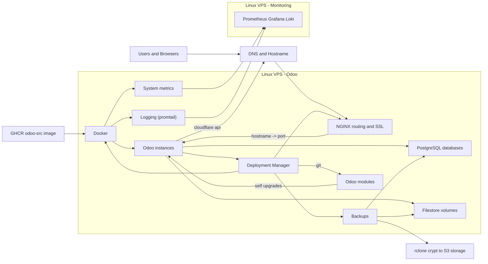

# Deployment Manager for Odoo images

## Abstract
This project supports self-hosted Odoo deployments on a Linux host. It provides a custom Odoo Docker image, a short one-time Ubuntu setup command list, and an XML-RPC deployment manager for instance lifecycle tasks such as create/reset/restart/upgrade, hostname-to-port routing updates, and SSL certificate management. It also handles client-side encrypted database and filestore backup/restore workflows using `pg_dump`/`pg_restore` and `rclone` (with zero-knowledge `crypt` overlay), with scheduled retention cleanup.

The XML-RPC API can be used from an Odoo instance to do self upgrades of Odoo source code.

## System architecture


* XML-RPC deployment-manager for running remote commands
    * Deploy and manage Odoo containers.
    * Git operations to allow an Odoo application that updates itself.
    * Manage custom NGINX/SSL configurations for the Odoo containers.
* Custom docker image with odoo source install + custom pip packages.
    * Packages: https://github.com/elmeriniemela/deploy-manager/pkgs/container/odoo-src
    * Github container registry: https://docs.github.com/en/packages/working-with-a-github-packages-registry/working-with-the-container-registry
    * Python packages from here: https://github.com/odoo/odoo/blob/19.0/debian/control
        * Saved to apt.txt
        * Print missing: while read -r x; do grep -q "$x" Dockerfile || echo "$x"; done < ./apt.txt
* Odoo Modules:
    * Allow self updates of Odoo source code
    * Custom modules https://github.com/elmeriniemela/tabularium
* CI pipeline with Github actions:
    * Actions defined here at `src/tabularium/.github/workflows/test.yml`
    * Depends on the docker container image defined by this repository.
    * Documentation: https://docs.github.com/en/actions/learn-github-actions/understanding-github-actions
* Monitoring
    * One monitoring server where multiple Odoo servers can send diagnostics and logging data.
    * prometheus+grafana+loki: https://github.com/elmeriniemela/grafana-loki
    * Import dashboards: https://grafana.com/grafana/dashboards/1860-node-exporter-full/


## Installation

#### Prerequisite

Use a fresh Ubuntu 24.04 LTS server and a separate empty Hetzner Volume. Attach the
volume without formatting or automatically mounting it. This is not an in-place
migration. The commands below format the selected device, so inspect it carefully
first. See [LUKS.md](LUKS.md)
for the storage layout and recovery precautions.

Point `19.eniemela.fi` to this server and allow TCP 9019 in the host and
Hetzner firewalls. The agent is available at `https://19.eniemela.fi:9019`
through nginx basic authentication; its backend is loopback-only on port 8019.

#### SSH key setup (optional, repos are public)
* `scp .gitconfig 19.eniemela.fi:`
* `cd .ssh && ssh-keygen -f id_ecdsa -t ecdsa -b 521`
* `cat id_ecdsa.pub`
* go to github / settings / SSH keys / Add 'Odoo 19.0 Hetzner Server key'
    * https://github.com/settings/keys

#### Installation

Run the following as root. Identify the volume by matching its `MODEL`, `SERIAL`,
and `SIZE` with the Hetzner Console. Use its `/dev/sdX` name only for the initial
format. Afterward, save the stable LUKS UUID path in root's `.bashrc` for later
login shells. `luksFormat` and `mkfs.ext4` destroy data on the selected device,
so confirm the `lsblk`, `findmnt`, and `wipefs` output before continuing. LUKS
asks for the passphrase interactively and does not store it on the server.

```bash
git clone -b 19.0 --recurse-submodules --shallow-submodules https://github.com/elmeriniemela/deploy-manager.git /opt/19
cd /opt/19
apt update
apt install -y cryptsetup
lsblk -So NAME,MODEL,SERIAL,SIZE,TYPE
cryptsetup luksFormat --type luks2 /dev/sdX
LUKS_UUID="$(cryptsetup luksUUID /dev/sdX)" && echo "$LUKS_UUID"
udevadm trigger --action=change --name-match=/dev/sdX
udevadm settle
echo "export HETZNER_VOL=\"/dev/disk/by-uuid/$LUKS_UUID\"" >> /root/.bashrc
export HETZNER_VOL="/dev/disk/by-uuid/$LUKS_UUID"
readlink -e "$HETZNER_VOL"
cryptsetup open "$HETZNER_VOL" appdata
mkfs.ext4 /dev/mapper/appdata
cryptsetup luksHeaderBackup "$HETZNER_VOL" --header-backup-file "/root/appdata-luks-header-$LUKS_UUID.img"
```

Append the UUID entry to `/etc/crypttab`:

```bash
echo "appdata UUID=$LUKS_UUID none luks,noauto" >> /etc/crypttab
```

Disable swap, comment its active `/etc/fstab` entries, and append the encrypted
filesystem and bind mounts. These append commands are for the one-time fresh-host
setup; do not run them twice.

```bash
echo '/dev/mapper/appdata /srv/secure ext4 noauto 0 2' >> /etc/fstab
echo '/srv/secure/postgresql /var/lib/postgresql none noauto,bind 0 0' >> /etc/fstab
echo '/srv/secure/docker /var/lib/docker none noauto,bind 0 0' >> /etc/fstab
echo '/srv/secure/containerd /var/lib/containerd none noauto,bind 0 0' >> /etc/fstab
echo '/srv/secure/odoo-config /etc/odoo none noauto,bind 0 0' >> /etc/fstab
echo '/srv/secure/logs/nginx /var/log/nginx none noauto,bind 0 0' >> /etc/fstab
echo '/srv/secure/logs/postgresql /var/log/postgresql none noauto,bind 0 0' >> /etc/fstab
echo '/srv/secure/nginx-temp /var/lib/nginx none noauto,bind 0 0' >> /etc/fstab
systemctl daemon-reload
```

Create and mount the encrypted directories before installing the services:

```bash
install -d /srv/secure
mount /srv/secure
install -d /srv/secure/postgresql /srv/secure/docker /srv/secure/containerd /srv/secure/odoo-config
install -d /srv/secure/logs/nginx /srv/secure/logs/postgresql /srv/secure/nginx-temp
install -d -m 0700 /srv/secure/rclone-config /srv/secure/rclone-cache /srv/secure/backups /srv/secure/secrets
install -d -m 0711 /srv/secure/tmp
install -d /var/lib/postgresql /var/lib/docker /var/lib/containerd /etc/odoo
install -d /var/log/nginx /var/log/postgresql /var/lib/nginx
mount /var/lib/postgresql
mount /var/lib/docker
mount /var/lib/containerd
mount /etc/odoo
mount /var/log/nginx
mount /var/log/postgresql
mount /var/lib/nginx
bash ./ubuntu-install.sh
```

The installer is intentionally a one-time, linear list of package and file
installation commands. Read it before running it; it has no device selection,
formatting logic, loops, or conditional branches.

Finish the configuration and start the application services:

```bash
htpasswd -B -C 12 -c /etc/nginx/.htpasswd cloud
chown root:www-data /etc/nginx/.htpasswd
chmod 640 /etc/nginx/.htpasswd
vim /srv/secure/rclone-config/rclone.conf
vim /srv/secure/secrets/cloudflare.ini
export TMPDIR=/srv/secure/tmp
/root/agent-venv19/bin/python -m agentd.api ssl_wildcard
ln -s /etc/nginx/sites-available/00_agent19.conf /etc/nginx/sites-enabled/00_agent19.conf
ln -s /etc/nginx/sites-available/odoo.conf /etc/nginx/sites-enabled/odoo.conf
nginx -t
systemctl start odoo-app.target
su - postgres -c "createuser -s root"
```

Copy `/root/appdata-luks-header-<uuid>.img` to offline storage, verify the copy,
then delete the server copy. Keep the passphrase separately.

The bootstrap installs Docker's loopback API override automatically. Configure
the Loki Docker logging plugin below before creating Odoo containers.

After every reboot, Ubuntu and SSH are available but application services stay
stopped. Unlock, mount, and start them with the same ordinary commands:

```bash
cryptsetup open "$HETZNER_VOL" appdata
mount /srv/secure
mount /var/lib/postgresql
mount /var/lib/docker
mount /var/lib/containerd
mount /etc/odoo
mount /var/log/nginx
mount /var/log/postgresql
mount /var/lib/nginx
nginx -t
systemctl start odoo-app.target
```

The systemd drop-ins installed by `ubuntu-install.sh` prevent protected services
from starting while any encrypted mount unit is inactive. Use `findmnt /srv/secure`
and `findmnt /var/lib/docker` to inspect mounts, and `systemctl status
odoo-app.target` to inspect the services.

The encrypted filesystem also contains nginx request-body temporary files,
agent temporary files and rotating agent logs. Do not use unencrypted `/tmp` or
`/var/tmp` for database dumps. Persistent swap is disabled. Confirm that
`swapon --show` is empty before starting the application services.

Do not rerun the one-time installer as an update mechanism. Use `./update.sh` for
this release and make later host configuration changes as explicit commands.

#### Adding Odoo 20 later

Create a 20.0 branch and replace release-specific 19 values with 20, including the
service/logrotate filenames. Clone that branch to `/opt/20`, create its Python
virtualenv, install its systemd unit, appdata drop-in, logrotate file, and nginx
site with the corresponding individual commands from `ubuntu-install.sh`. Configure
DNS and TCP 9020 for `https://20.eniemela.fi:9020`; the backend uses
`127.0.0.1:8020`. Validate nginx, enable the new agent, and start it through
`odoo-app.target`.

Each agent discovers and backs up only containers with its release's
`odoo.version` label. UIDs and HTTP/gevent ports must be unique across the entire
server, including stopped containers. Both releases share the PostgreSQL cluster,
backup remote and nginx routing maps. Static files are served by the selected
Odoo container. Updating one clone with `./update.sh` restarts only its agent.

#### Promtail setup (TODO: deprecated, migrate to Alloy)
* Promtail is an agent which ships the contents of local logs to a private Grafana Loki instance: https://grafana.com/docs/loki/latest/send-data/promtail/
* Attach new server to the same private network as "monitoring" in hetzner cloud.
* docker run \
    -v ./promtail:/etc/promtail \
    -v /var/log:/var/log \
    --restart unless-stopped \
    --name promtail -d \
    grafana/promtail:latest -config.file=/etc/promtail/config.yml

* https://grafana.com/docs/loki/latest/send-data/docker-driver/
* https://grafana.com/docs/loki/latest/send-data/docker-driver/configuration/
* `docker plugin install grafana/loki-docker-driver --alias loki --grant-all-permissions`

#### Prometheus node exporter monitoring:
* Prometheus exporter for hardware and OS metrics exposed by *NIX kernels, written in Go with pluggable metric collectors: https://github.com/prometheus/node_exporter
* docker run -d \
    --net="host" \
    --pid="host" \
    -v "/:/host:ro,rslave" \
    --restart unless-stopped \
    quay.io/prometheus/node-exporter:latest \
    --path.rootfs=/host

#### Creating a personal github access token (READ only):
* https://docs.github.com/en/authentication/keeping-your-account-and-data-secure/managing-your-personal-access-tokens#creating-a-fine-grained-personal-access-token
* Go to Settings / Developer / New personal access token (classic) / Add 'Odoo 19.0 Hetzner Server key' + add repo and write:packages
    * https://github.com/settings/tokens/new
* `docker login ghcr.io -u elmeriniemela`

#### Building the image
* `docker build -t ghcr.io/elmeriniemela/odoo-src:19.0 /opt/19`
* https://docs.github.com/en/packages/working-with-a-github-packages-registry/working-with-the-container-registry#building-container-images
* `docker push ghcr.io/elmeriniemela/odoo-src:19.0`


#### Backup setup (Client-Side Encrypted S3 Backups):
* All database dumps and Odoo filestores are encrypted client-side via rclone's `crypt` backend before upload to AWS S3.
* Create a dedicated S3 bucket in AWS: `odoo-backups-crypt` (e.g. in `eu-north-1`).
* Generate an obscured password for rclone config:
  * `rclone obscure 'YourStrongSecretPassphrase' --config /srv/secure/rclone-config/rclone.conf`
* In `/srv/secure/rclone-config/rclone.conf`, add the `[backup-crypt]` section:
  ```ini
  [backup-crypt]
  type = crypt
  remote = awsbucket:odoo-backups-crypt
  filename_encryption = off
  directory_name_encryption = false
  password = <output from rclone obscure>
  ```
  *(Important: Back up this passphrase in an offline password manager. If lost, encrypted backups cannot be recovered!)*
* Mount the encrypted remote:
  * `systemctl restart rclone-mount.service`
* Scheduled cron:
  * `crontab -e`
  * `30 00 * * * mountpoint -q /srv/secure && cd /opt/19 && TMPDIR=/srv/secure/tmp /root/agent-venv19/bin/python -m agentd.backup >> /srv/secure/logs/deploy-manager19.log 2>&1`

##### Copying existing unencrypted backups to the new encrypted bucket:
If you have existing plaintext backups in `odoobackup1` and wish to copy them into the new encrypted bucket:
1. Copy into the encrypted remote (reads unencrypted files, encrypts locally, writes to `odoo-backups-crypt`):
   * `rclone copy awsbucket:odoobackup1 backup-crypt: --config /srv/secure/rclone-config/rclone.conf --progress --transfers=16`
2. Verify the files through `/srv/secure/backups` or `rclone --config /srv/secure/rclone-config/rclone.conf ls backup-crypt:`
3. Once verified, the old unencrypted bucket `odoobackup1` can be kept as a fallback or purged:
   * `rclone purge awsbucket:odoobackup1 --config /srv/secure/rclone-config/rclone.conf`

##### Decrypting a single file without rclone:
To manually decrypt a downloaded file without rclone (using only Python and `pip install pynacl`):
* `python3 docs/decrypt.py <encrypted_file> <decrypted_file> <password>`

#### Clone modules
* `cd /opt/19/src`
* `git clone -b 19.0 git@github.com:elmeriniemela/tabularium.git`
* `git clone -b 19.0 --depth=1 --single-branch git@github.com:odoo/odoo.git`
* `git clone -b 19.0 --depth=1 --single-branch git@github.com:OCA/OpenUpgrade.git`


## Other notes

#### Pulling the image
* `docker pull ghcr.io/elmeriniemela/odoo-src:19.0`

#### DB isolation:
* https://wiki.postgresql.org/wiki/Shared_Database_Hosting
* https://wiki.postgresql.org/images/d/d1/Managing_rights_in_postgresql.pdf

### Local setup
* sudo docker run \
    -v /home/elmeri/Odoo/src/16:/mnt:ro \
    -v /var/run/postgresql:/var/run/postgresql \
    -v /home/elmeri/Odoo/src/16/own-docker.conf:/etc/odoo/odoo.conf:ro \
    -v /home/elmeri/.local/share/Odoo:/var/lib/odoo \
    -p 127.0.0.1:8016:8069 \
    -p 127.0.0.1:9016:8072 \
    --name eniemela_16 -ti ghcr.io/elmeriniemela/odoo-src:19.0
* sudo docker restart eniemela_16 && sudo docker attach eniemela_16
* sudo docker exec -it -u root eniemela_16 bash
* sudo docker restart eniemela_16 && sudo docker exec -it -u root eniemela_16 odoo -u investment_portfolio --http-port=9999 --stop-after-init && sudo docker restart eniemela_16 && sudo docker attach eniemela_16

### Local mermaid-cli installation for AGENTS.md verification of the diagram:
* `sudo pacman -S nodejs npm`
* `sudo npm install -g @mermaid-js/mermaid-cli`
* `npx puppeteer browsers install chrome-headless-shell@131.0.6778.204`. NOTE: mmdc pins to a specific version, adapt if needed.
* See AGENTS.md for usage.

### Tests
* `python3 -m unittest discover -s agentd/tests -t .`
* `coverage run -m unittest discover -s agentd/tests -t . && coverage report -m`

#### Random notes
* Docker logs
* Docker volumes: `ls /var/lib/docker/volumes`
* Delete everything: `docker system prune -a --volumes`
* Remote access: https://docs.docker.com/config/daemon/remote-access/
* Docker API: https://docs.docker.com/engine/api/latest/
* Login as root: `docker exec -it -u root <uid> bash`
