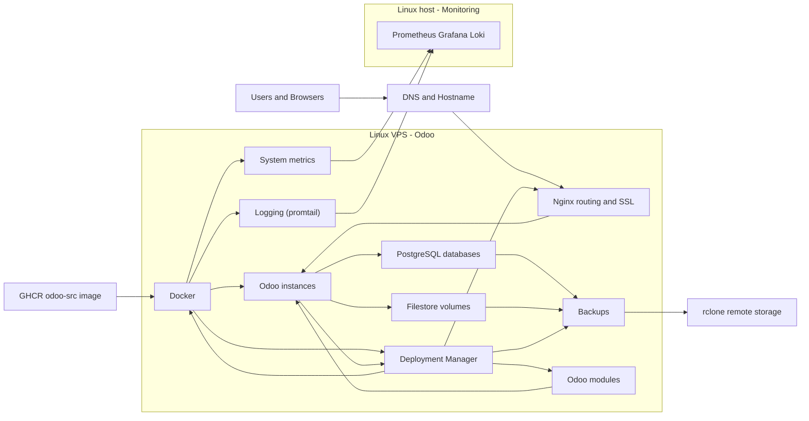

# Deployment Manager for Odoo images

## Abstract
This project automates self-hosted Odoo deployments on a Linux host. It provides a custom Odoo Docker image, host bootstrap scripts (Docker/PostgreSQL/nginx/systemd), and an XML-RPC deployment manager for instance lifecycle tasks such as create/reset/restart/upgrade, hostname-to-port routing updates, and SSL certificate management. It also handles database and filestore backup/restore workflows using `pg_dump`/`pg_restore` and `rclone`, with scheduled retention cleanup.

The XML-RPC API can be used from an Odoo instance to do self upgrades of Odoo source code.

## System architecture


## Installation

#### Architecture:
* XML-RPC deployment-manager for running remote commands
    * Deploy and manage Odoo containers.
    * Git operations to allow an Odoo application that updates itself.
    * Manage custom NGINX/SSL configurations for the Odoo containers.
* Custom docker image with odoo source install + custom pip packages.
    * Packages: https://github.com/elmeriniemela/deploy-manager/pkgs/container/odoo-src
    * Github container registry: https://docs.github.com/en/packages/working-with-a-github-packages-registry/working-with-the-container-registry
    * Python packages from here: https://github.com/odoo/odoo/blob/18.0/debian/control
* Odoo Modules:
    * Allow self updates of Odoo source code
    * Custom modules https://github.com/elmeriniemela/tabularium
* CI pipeline with Github actions:
    * Actions defined here at `src/tabularium/.github/workflows/test.yml`
    * Depends on the docker container image available at https://github.com/elmeriniemela/odoo-ci
    * Based on https://github.com/oca/oca-ci/pkgs/container/oca-ci%2Fpy3.10-odoo18.0
    * Documentation: https://docs.github.com/en/actions/learn-github-actions/understanding-github-actions
* Monitoring
    * One monitoring server where multiple Odoo servers can send diagnostics and logging data.
    * prometheus+grafana+loki: https://github.com/elmeriniemela/grafana-loki
    * Import dashboards: https://grafana.com/grafana/dashboards/1860-node-exporter-full/


#### Creating a personal github access token (READ only):
* https://docs.github.com/en/authentication/keeping-your-account-and-data-secure/managing-your-personal-access-tokens#creating-a-fine-grained-personal-access-token
* Go to Settings / Developer / New personal access token (classic) / Add 'Odoo 18.0 Hetzner Server key' + add repo and write:packages
* `docker login ghcr.io -u elmeriniemela`

#### Prerequisite
* `scp .gitconfig agent18.eniemela.fi:`
* `cd .ssh && ssh-keygen -f id_ecdsa -t ecdsa -b 521`
* `cat id_ecdsa.pub`
* go to github / settings / SSH keys / Add 'Odoo 18.0 Hetzner Server key'
* `mkdir -p /root/.config/rclone/`
* `cp rclone.conf /root/.config/rclone/rclone.conf`
* `vim /root/.config/rclone/rclone.conf`
* `cp cloudflare.ini /root/cloudflare.ini`
* `vim /root/cloudflare.ini`

#### Installation
* `git clone -b 18.0 --recurse-submodules --shallow-submodules https://github.com/elmeriniemela/deploy-manager.git /opt/odoo-agent`
* `cd /opt/odoo-agent`
* `./ubuntu-install.sh`
* `systemctl edit docker.service`
```
[Service]
ExecStart=
ExecStart=/usr/bin/dockerd -H fd:// -H tcp://127.0.0.1:2375 --containerd=/run/containerd/containerd.sock
```
* `systemctl daemon-reload`
* `systemctl restart docker.service`
* `systemctl restart postgresql`
* `su - postgres -c "createuser -s root"`
* `source /root/agent-venv/bin/activate`
* `python agentd/api.py ssl_wildcard`
* `systemctl restart nginx`

#### Promtail setup (TODO: deprecated, migrate to Alloy)
* Promtail is an agent which ships the contents of local logs to a private Grafana Loki instance: https://grafana.com/docs/loki/latest/send-data/promtail/
* Attach new server to the same private network as "monitoring" in hetzner cloud.
* docker run \
    -v ./promtail:/etc/promtail \
    -v /var/log:/var/log \
    --restart unless-stopped \
    --name promtail -d \
    grafana/promtail:latest -config.file=/etc/promtail/config.yml

* https://grafana.com/docs/loki/latest/send-data/docker-driver/
* https://grafana.com/docs/loki/latest/send-data/docker-driver/configuration/
* `docker plugin install grafana/loki-docker-driver --alias loki --grant-all-permissions`

#### Prometheus node exporter monitoring:
* Prometheus exporter for hardware and OS metrics exposed by *NIX kernels, written in Go with pluggable metric collectors: https://github.com/prometheus/node_exporter
* docker run -d \
    --net="host" \
    --pid="host" \
    -v "/:/host:ro,rslave" \
    --restart unless-stopped \
    quay.io/prometheus/node-exporter:latest \
    --path.rootfs=/host

#### Building the image
* `docker build -t ghcr.io/elmeriniemela/odoo-src:18.0 /opt/odoo-agent`
* https://docs.github.com/en/packages/working-with-a-github-packages-registry/working-with-the-container-registry#building-container-images
* `sudo docker push ghcr.io/elmeriniemela/odoo-src:18.0`


#### Backup setup:
* `crontab -e`
* `30 00 * * * cd /opt/odoo-agent && /root/agent-venv/bin/python ./agentd/backup.py`


## Other notes

#### Pulling the image
* `docker pull ghcr.io/elmeriniemela/odoo-src:18.0`

#### DB isolation:
* https://wiki.postgresql.org/wiki/Shared_Database_Hosting
* https://wiki.postgresql.org/images/d/d1/Managing_rights_in_postgresql.pdf

### Local setup
* sudo docker run \
    -v /home/elmeri/Odoo/src/16:/mnt:ro \
    -v /var/run/postgresql:/var/run/postgresql \
    -v /home/elmeri/Odoo/src/16/own-docker.conf:/etc/odoo/odoo.conf:ro \
    -v /home/elmeri/.local/share/Odoo:/var/lib/odoo \
    -p 127.0.0.1:8016:8069 \
    -p 127.0.0.1:9016:8072 \
    --name eniemela_16 -ti ghcr.io/elmeriniemela/odoo-src:18.0
* sudo docker restart eniemela_16 && sudo docker attach eniemela_16
* sudo docker exec -it -u root eniemela_16 bash
* sudo docker restart eniemela_16 && sudo docker exec -it -u root eniemela_16 odoo -u investment_portfolio --http-port=9999 --stop-after-init && sudo docker restart eniemela_16 && sudo docker attach eniemela_16

### Local mermaid-cli installation for AGENTS.md verification of the diagram:
* `sudo pacman -S nodejs npm`
* `sudo npm install -g @mermaid-js/mermaid-cli`
* `npx puppeteer browsers install chrome-headless-shell@131.0.6778.204`. NOTE: mmdc pins to a specific version, adapt if needed.
* See AGENTS.md for usage.

#### Random notes
* Docker logs
* Docker volumes: `ls /var/lib/docker/volumes`
* Delete everything: `docker system prune -a --volumes`
* Remote access: https://docs.docker.com/config/daemon/remote-access/
* Docker API: https://docs.docker.com/engine/api/latest/
* Login as root: `docker exec -it -u root <uid> bash`
