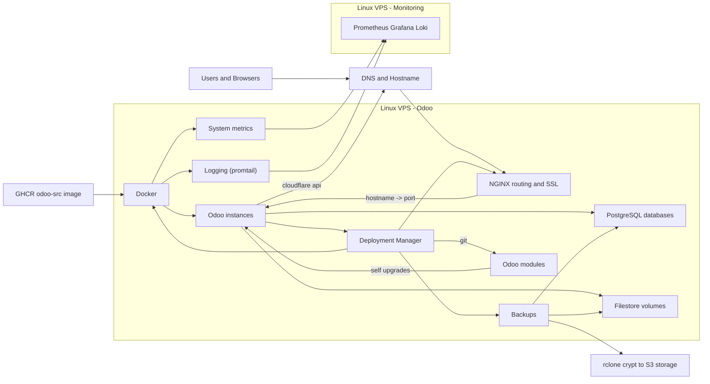

# Deployment Manager for Odoo images

## Abstract
This project supports self-hosted Odoo deployments on a Linux host. It provides a custom Odoo Docker image, a rerunnable Ubuntu host configuration script, and an XML-RPC deployment manager for instance lifecycle tasks such as create/reset/restart/upgrade, hostname-to-port routing updates, and SSL certificate management. It also handles client-side encrypted database and filestore backup/restore workflows using `pg_dump`/`pg_restore` and `rclone` (with zero-knowledge `crypt` overlay), with scheduled retention cleanup.

The XML-RPC API can be used from an Odoo instance to do self upgrades of Odoo source code.

## System architecture


* XML-RPC deployment-manager for running remote commands
    * Deploy and manage Odoo containers.
    * Git operations to allow an Odoo application that updates itself.
    * Manage custom NGINX/SSL configurations for the Odoo containers.
* Custom docker image with odoo source install + custom pip packages.
    * Packages: https://github.com/elmeriniemela/deploy-manager/pkgs/container/odoo-src
    * Github container registry: https://docs.github.com/en/packages/working-with-a-github-packages-registry/working-with-the-container-registry
    * Python packages from here: https://github.com/odoo/odoo/blob/19.0/debian/control
        * Saved to apt.txt
        * Print missing: while read -r x; do grep -q "$x" Dockerfile || echo "$x"; done < ./apt.txt
* Odoo Modules:
    * Allow self updates of Odoo source code
    * Custom modules https://github.com/elmeriniemela/tabularium
* CI pipeline with Github actions:
    * Actions defined here at `src/tabularium/.github/workflows/test.yml`
    * Depends on the docker container image defined by this repository.
    * Documentation: https://docs.github.com/en/actions/learn-github-actions/understanding-github-actions
* Monitoring
    * One monitoring server where multiple Odoo servers can send diagnostics and logging data.
    * prometheus+grafana+loki: https://github.com/elmeriniemela/grafana-loki
    * Import dashboards: https://grafana.com/grafana/dashboards/1860-node-exporter-full/


## Installation

#### Prerequisite

Use a fresh Ubuntu 26.04 LTS server and a separate empty Hetzner Volume. Attach the
volume without formatting or automatically mounting it. This is not an in-place
migration. The commands below format the selected device, so inspect it carefully
first. See [LUKS.md](LUKS.md)
for the storage layout and recovery precautions.

Point `19.eniemela.fi` to this server and allow TCP 9019 in the host and
Hetzner firewalls. The agent is available at `https://19.eniemela.fi:9019`
through nginx basic authentication; its backend is loopback-only on port 8019.

#### Installation

Run the following as root. Identify the volume by matching its `MODEL`, `SERIAL`,
and `SIZE` with the Hetzner Console. Use its `/dev/sdX` name only for the initial
format; `/etc/crypttab` stores the stable UUID used after that. `luksFormat` and
`mkfs.ext4` destroy data on the selected device, so confirm the `lsblk` output before continuing.
LUKS asks for the passphrase interactively and does not store it on the server.

```bash
apt update
apt install -y cryptsetup git vim tmux
git clone -b 19.0 --recurse-submodules --shallow-submodules https://github.com/elmeriniemela/deploy-manager.git /opt/19
cd /opt/19
lsblk -So NAME,MODEL,SERIAL,SIZE,TYPE
INSTALL_DEVICE=/dev/sdX
cryptsetup luksFormat --type luks2 "$INSTALL_DEVICE"
LUKS_UUID="$(cryptsetup luksUUID "$INSTALL_DEVICE")" && echo "$LUKS_UUID"
udevadm trigger --action=change --name-match="$INSTALL_DEVICE"
udevadm settle
readlink -e "/dev/disk/by-uuid/$LUKS_UUID"
cryptsetup open "$INSTALL_DEVICE" appdata
mkfs.ext4 /dev/mapper/appdata
cryptsetup luksHeaderBackup "$INSTALL_DEVICE" --header-backup-file "/root/appdata-luks-header-$LUKS_UUID.img"
```

Append the UUID entry to `/etc/crypttab`:

```bash
echo "appdata UUID=$LUKS_UUID none luks,noauto" >> /etc/crypttab
```

Configure the host. This command is idempotent and can be rerun after a partial
failure or configuration change. It also installs the Loki Docker plugin,
Promtail, node exporter, the scheduled backup job, and the required module
repositories.

```bash
bash ./ubuntu-install.sh
```

Finish the configuration and start the application services:

```bash
htpasswd -B -C 12 -c /etc/nginx/.htpasswd cloud
chown root:www-data /etc/nginx/.htpasswd
chmod 640 /etc/nginx/.htpasswd
# Add passwrods
vim /srv/secure/rclone-config/rclone.conf
vim /srv/secure/secrets/cloudflare.ini

export TMPDIR=/srv/secure/tmp
/usr/bin/python3 -m agentd.api ssl_wildcard
# OR
rsync -aHAX /etc/letsencrypt/ root@NEW_SERVER:/etc/letsencrypt/

nginx -t
systemctl start odoo-app.target
```

Encrypt `/root/appdata-luks-header-<uuid>.img` before transferring it, then
remove the plaintext copy. See [LUKS.md](LUKS.md#encrypting-the-header-backup).

After every reboot, Ubuntu and SSH are available but application services stay
stopped. From a root login shell, unlock, mount, and start them with:

```bash
systemctl start systemd-cryptsetup@appdata.service
systemctl start odoo-app.target
```

The systemd drop-ins installed by `ubuntu-install.sh` pull in the encrypted bind
mounts and prevent protected services from starting if a required mount fails.
Use `findmnt /srv/secure` and `findmnt /var/lib/docker` to inspect mounts, and
`systemctl status odoo-app.target` to inspect the services.

The encrypted filesystem also contains nginx request-body temporary files,
agent temporary files and rotating agent logs. Do not use unencrypted `/tmp` or
`/var/tmp` for database dumps. Persistent swap is disabled. Confirm that
`swapon --show` is empty before starting the application services.

#### Backup setup (Client-Side Encrypted S3 Backups):
* All database dumps and Odoo filestores are encrypted client-side via rclone's `crypt` backend before upload to AWS S3.
* Generate an obscured password for rclone config:
  * `rclone obscure 'YourStrongSecretPassphrase' --config /srv/secure/rclone-config/rclone.conf`
  *(Important: Back up this passphrase in an offline password manager. If lost, encrypted backups cannot be recovered!)*
* `/etc/cron.d/deploy-manager19` runs the scheduled backup at 00:30 daily.

##### Decrypting a single file without rclone:
To manually decrypt a downloaded file without rclone (using only Python and `pip install pynacl`):
* `python3 docs/decrypt.py <encrypted_file> <decrypted_file> <password>`

## Other notes

#### Pulling the image
* `docker pull ghcr.io/elmeriniemela/odoo-src:19.0`

#### DB isolation:
* https://wiki.postgresql.org/wiki/Shared_Database_Hosting
* https://wiki.postgresql.org/images/d/d1/Managing_rights_in_postgresql.pdf


#### Creating a personal github access token (write packages only):
* https://docs.github.com/en/authentication/keeping-your-account-and-data-secure/managing-your-personal-access-tokens#creating-a-fine-grained-personal-access-token
* Go to Settings / Developer / New personal access token (classic) / Add 'Odoo 19.0 Hetzner Server key' + add repo and write:packages
    * https://github.com/settings/tokens/new
* `docker login ghcr.io -u elmeriniemela`

### Image development and publishing

Production hosts pull the public image without GitHub credentials. Building and
publishing require a developer workstation authenticated to GHCR with package
write permission.

* `docker build -t ghcr.io/elmeriniemela/odoo-src:19.0 .`
* `docker push ghcr.io/elmeriniemela/odoo-src:19.0`
* https://docs.github.com/en/packages/working-with-a-github-packages-registry/working-with-the-container-registry

#### SSH key setup (optional, repos are public)
* `scp .gitconfig 19.eniemela.fi:`
* `cd .ssh && ssh-keygen -f id_ecdsa -t ecdsa -b 521`
* `cat id_ecdsa.pub`
* go to github / settings / SSH keys / Add 'Odoo 19.0 Hetzner Server key'
    * https://github.com/settings/keys

### Local mermaid-cli installation for AGENTS.md verification of the diagram:
* Install `sudo pacman -S mermaid-cli` for your development platform.
* See AGENTS.md for the rerunnable validation commands.

### Tests
* `python3 -m unittest discover -s agentd/tests -t .`
* `coverage run -m unittest discover -s agentd/tests -t . && coverage report -m`

#### Random notes
* Docker logs
* Docker volumes: `ls /var/lib/docker/volumes`
* Delete everything: `docker system prune -a --volumes`
* Login as root: `docker exec -it -u root <uid> bash`
